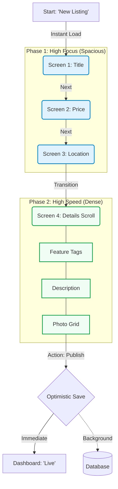
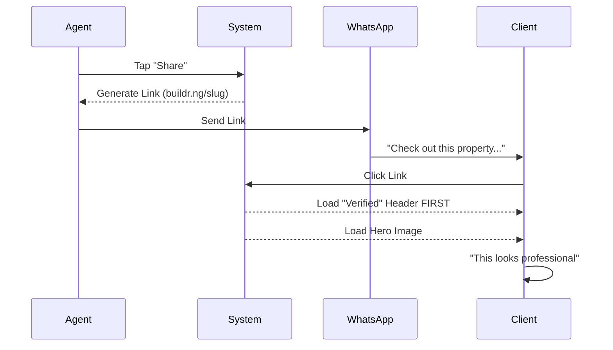

# UX Design Specification Buildr

**Author:** User
**Date:** 2026-01-01

---

<!-- UX design content will be appended sequentially through collaborative workflow steps -->

## Executive Summary

### Project Vision
Buildr is a **Mobile-First, Offline-Capable Real Estate Wizard** designed for the specific constraints of the Nigerian market (3G networks, low-trust environment). It replaces the complex "Drag and Drop" canvas with a **Linear Wizard** that prioritizes speed, strict governance, and "Optimistic" performance. The goal is to allow a user with a poor internet connection to publish a professional, compliant listing in under 5 minutes.

### Target Users
*   **Chibuzo (Agency Manager):** Needs to manage a team and ensure brand consistency without micromanaging. Values speed and "Locked" templates.
*   **Fatima (Field Agent):** Works on-site with unstable 3G. Needs a tool that never loses data and feels instant (Optimistic UI).
*   **Emeka (Developer/Asset Uploader):** Uploads heavy raw images. Needs a system that automatically optimizes assets without him thinking about it.

### Key Design Challenges
*   **The "3G Gap":** Designing an interface that feels "native" and "instant" even when the network is dead. (Solution: Optimistic UI & background sync visualization).
*   **Governance vs. Freedom:** Enforcing strict constraints (4:3 images, pre-set colors) without making the user feel restricted or frustrated.
*   **Trust at a Glance:** Integrating "Verified" badges and NDPR consents in a way that feels premium, not bureaucratic.

### Design Opportunities
*   **"Walled Garden" Aesthetics:** Since we control the output completely, we can ensure every published page looks like "Lekki Luxury" regardless of the user's design skills.
*   **Micro-Interactions as Feedback:** Using subtle animations to show "Saving..." or "Optimizing..." builds trust in the system's reliability during network hiccups.
*   **Team-Centric Dashboard:** A clean, role-based dashboard can become the "Operating System" for small real estate agencies.

## Core User Experience

### Defining Experience
The heartbeat of Buildr is **Velocity over Customization**. The core loop is **Snap -> Type -> Share**. It prioritizes immediate feedback and frictionless progression over granular control, mimicking the feel of a native mobile app rather than a traditional web form.

### Platform Strategy
*   **Mobile-First Touch:** Interaction targets > 44px for thumb-friendly usage.
*   **Keyboard Awareness:** Forms designed to remain visible and usable when virtual keyboards consume screen space on Android devices.
*   **Offline Tolerance:** The UI never freezes or blocks interactions due to network state. "Saving" is an optimistic background process, not a blocking modal.

### Effortless Interactions
*   **Optimistic Saves:** The "Save" button transitions to "Saved" instantly upon tap, treating the server sync as an asynchronous detail.
*   **Auto-Correction:** Instead of erroring on bad image ratios, the system automatically crops to 4:3.
*   **Smart Defaults:** Forms pre-fill currency (Naira) and units (sqm), removing repetitive data entry.

### Critical Success Moments
*   **The "Publish" Instant:** The moment the user hits "Publish", the "Live Link" card must appear instantly. A delay here breaks the illusion of competence. The "Copy Link" action must work immediately.

### Experience Principles
1.  **Don't Make Me Wait:** UI State trumps Server State. The interface moves at the speed of the user's thought, not the network's latency.
2.  **Don't Let Me Fail:** The system silently fixes aesthetic errors (aspect ratios, typography) to ensure a premium result.
3.  **Trust Every Pixel:** Draft states must look as polished as published states to maintain user confidence throughout the creation process.

## Desired Emotional Response

### Primary Emotional Goals
**"Professional Confidence"**
In a chaotic, low-trust market, the user feels anchored. The tool conveys: "I am a professional. This tool protects my brand. My work is safe."

### Emotional Journey Mapping
1.  **Open:** Relief (Instant load, no white screen).
2.  **Type:** Flow (Frictionless entry, optimistic saving).
3.  **Publish:** Pride (The result looks "Lekki Luxury" standard).

### Micro-Emotions
*   **Target:** *Security* (Relentless "Saved" checkmark to combat data-loss anxiety).
*   **Target:** *Mastery* (System auto-fixes mistakes, making the user feel skilled).
*   **Avoid:** *Anxiety* (Network spinners, "Did it save?" ambiguity).
*   **Avoid:** *Incompetence* (Stretched images, bad fonts).

### Design Implications
*   **The "Verified" Badge:** Display this prominently in the dashboard, not just the public page, to remind the user of their validated status.
*   **Zero-Spinner Policy:** Use non-blocking status indicators (e.g., a small "syncing" cloud icon) instead of full-screen spinners to prevent anxiety.

## UX Pattern Analysis & Inspiration

### Inspiring Products Analysis
*   **WhatsApp Status (The "Speed" Benchmark):** Agents use this because it's effortless. We steal the "Caption" flow and the "Send" button that never fails (optimistic).
*   **PiggyVest (The "Trust" Benchmark):** They successfully built digital trust in Nigeria. We steal their "Safe Lock" iconography (Shields, Checkmarks) to visualize our "Walled Garden" governance.
*   **Instagram Stories (The "Wizard" Benchmark):** The ultimate linear creation tool. We steal the "Post and Forget" optimistic uploading model.
*   **Airbnb (The "Visual" Benchmark):** *Added per request.* The gold standard for listing presentation. We steal their clean typography, simple price display, and "Trust at a Glance" (Host Badges/Reviews) to make our pages look premium.

### Transferable UX Patterns
*   **Optimistic "Send":** (From WhatsApp/IG) The user hits "Publish" and the UI closes immediately. The upload happens in the background.
*   **The "Verified" Shield:** (From PiggyVest/Airbnb) A ubiquitous visual anchor that reassures the user their data/listing is safe and professional.
*   **Image-First Layouts:** (From Airbnb) Hero images take up 50%+ of the screen real estate. Text is secondary but legible.

### Anti-Patterns to Avoid
*   **The "Jumia Clutter":** Overwhelming the user with banners, upsells, or "Recommended" items during the creation flow.
*   **The "Government Portal":** Long forms, tiny text, "Submit" buttons that timeout or show generic "Network Error" alerts.

### Design Inspiration Strategy
**Strategy:** "Mobile Velocity" (WhatsApp) + "Lekki Luxury Visuals" (Airbnb).
*   **Adopt:** WhatsApp's "Drafting" speed and Airbnb's "Listing" aesthetics.
*   **Adapt:** PiggyVest's "Savings" metaphors into "Asset Governance" metaphors (e.g., "Your image is Safe").
*   **Avoid:** Any interaction that feels like a "Desktop Website port".

## Design System Foundation

### Design System Choice
**Tailwind CSS (Utility-First) + shadcn/ui (Radix Primitives)**

### Rationale for Selection
*   **Performance (3G):** Tailwind generates minimal CSS at build time, crucial for the "Wizard App Shell" load time (NFR1). Radix primitives are headless and lightweight.
*   **Control (Walled Garden):** shadcn/ui is not a dependency but a copy-paste pattern. We can enforce "Lekki Luxury" constraints (e.g., locking down color tokens in `tailwind.config.js`) without fighting a library's defaults.
*   **Accessibility:** Radix handles complex ARIA roles instantly, ensuring NFR8 (Accessibility) compliance out of the box.

### Implementation Approach
*   **Component Strategy:** We will use `shadcn/ui` components as the base for our "Building Blocks" (Cards, Inputs, Buttons) but style them strictly to our "Design Compact".
*   **Token Strategy:** We will define strict Design Tokens (Colors, Typography, Spacing) in `tailwind.config.js` to prevent "magic numbers" in the codebase.

## Visual Experience Mechanics

### 1. Typography as UI (The Airbnb Influence)
*   **Concept:** 50% of the UI is text. We treat text as a graphic element.
*   **Mechanic:**
    *   **Headings:** Thick, dark sans-serif (Inter/Geist) for "Price" and "Location" to anchor the eye.
    *   **Labels:** Small, uppercase, tracking-wide for "TRUST SIGNALS" (e.g., VERIFIED • RC-12345).

### 2. The "Card" Structure (The Walled Garden)
*   **Concept:** "Everything is a card." Cards feel safe and contained.
*   **Mechanic:**
    *   **Input Cards:** White cards on a gray background. Focus state "lifts" the card (elevation + shadow), not just a border color change.
    *   **Output Cards:** The "Preview" looks exactly like the input card minus the cursor. Reinforces "What You See Is What You Get".

### 3. Visual Feedback (The Optimistic Mechanic)
*   **Motion as Status:**
    *   **Success:** "Save" checkmark pulses/animates. Green is a motion, not just a color.
    *   **Error:** Gentle "Shake" animation (iOS style) instead of aggressive red banners. Feels organic and correctable.

## Visual Design Foundation

### Color System: Dynamic Theming
Instead of a single brand color, the system uses a **Theme Engine** driven by CSS Variables (`--primary`, `--ring`). This allows users (Chibuzo) to select a palette that matches their agency brand from a strict list of presets.

*   **Neutral Foundation:** `Slate-50` to `Slate-950` (Tailwind). Used for all structural elements (Cards, Text, Borders) to ensure readability regardless of the selected theme.
*   **The "Lekki Luxury" Presets (MVP):**
    1.  **Executive Navy:** Deep Blue + Gold (Trust/Corporate).
    2.  **Growth Green:** Emerald + White (Land/Investment).
    3.  **Luxury Onyx:** Black + Silver (Premium/High-end).
    4.  **Urgency Red:** Crimson + White (Sales/Distress).

### Typography System
*   **Font Family:** **Inter** (Google Fonts).
*   **Rationale:** Highest legibility on small 3G screens. Neutral character allows the *Agency's* photos to shine without clashing font personalities.
*   **Type Scale:** Mobile-First.
    *   `text-base` (16px) is the minimum for inputs (prevents iOS zoom).
    *   `font-bold` used sparingly for Prices and Key Data.

### Spacing & Layout Foundation
*   **Grid:** Single Column (Mobile) -> Max-width 480px (Central Card).
*   **Spacing:** `gap-3` (12px) is our base unit. Tighter than the standard 16px to fit more data "above the fold" on mobile screens.

### Accessibility Considerations
*   **Contrast enforcement:** All "Presets" are pre-calculated to ensure white text on `--primary` background passes AA standards.
*   **Focus States:** All interactive elements use `ring-offset-2` to ensure visibility for keyboard/screen-reader navigation.

## Design Direction Decision

### Design Directions Explored
1.  **Direction A ("Visual Velocity"):** High-density form layout. Best for power users who want to see everything at once. Risk: Overwhelming on small screens.
2.  **Direction B ("Lekki Luxury"):** Spacious, one-question-per-screen layout. Best for focus and error prevention. Risk: Too slow for rapid entry.

### Chosen Direction
**The Hybrid Model**

### Design Rationale
We recognized that neither extreme serves the *entire* user journey perfectly.
*   **For High-Risk Inputs (Price, Location):** We use **Direction B** (Spacious). These fields define the property's value; a typo here is catastrophic. We need focus.
*   **For Low-Risk Inputs (Amenities, Description):** We use **Direction A** (Dense). Tapping "Pool", "Gym", "BQ" should be fast and require minimal scrolling.

### Implementation Approach
*   **Variable Spacing:** The Design System grid will support `gap-4` (Standard) and `gap-6` (Spacious) modes, switchable at the `Section` component level.
*   **Visualizer:** See the interactive comparison at `_bmad-output/planning-artifacts/ux-design-directions.html`.

## User Journey Flows

### Journey 1: The "Create Listing" (Hybrid Flow)
**Goal:** Chibuzo needs to create a high-quality listing without making errors on price, but quickly enough to do it on-site.
**Pattern:** *Spacious Focus* (for High Risk) -> *Dense Checklist* (for Low Risk).

### Journey 2: The "Client Preview" (Trust Flow)
**Goal:** Fatima shares a link, and the Client (Buyer) immediately trusts the content because of "Verified" signals.

### Flow Optimization Principles
1.  **The "Money" Pause:** We intentionally slow down the "Price" input (making it the only thing on the screen) to force the user to verify the zero count.
2.  **The "Tag" Sprint:** Amenities are presented as tap-friendly chips (Pool, Gym, BQ) rather than a typed list, speeding up the dense section.
3.  **Trust-First Loading:** On the public link, the "Verified Agent" badge loads *before* the images to frame the user's expectation.

## Component Strategy

### Design System Components (shadcn/ui)
We leverage `shadcn/ui` for the "Atomic" layer to ensure accessibility and speed:
*   **Basics:** `Button`, `Input`, `Label`, `Card`, `Dialog` (Alerts), `Toast` (Feedback).
*   **Navigation:** `Sheet` (Mobile Sidebar), `DropdownMenu`.
*   **Data:** `Badge` (Status), `Skeleton` (Loading States).

### Custom Components (The "Wizard Kit")
These components cover the unique "Hybrid Flow" requirements gaps:

#### 1. `WizardShell`
*   **Purpose:** The intelligent container for the creation flow.
*   **Behavior:** Dynamically switches layout modes based on the current step's metadata.
    *   *Mode A (Spacious):* Centers content vertically, hides secondary nav, focuses input.
    *   *Mode B (Dense):* Standard top-aligned, scrollable form layout.

#### 2. `BigInput` (Spacious Mode)
*   **Purpose:** For high-risk, single-focus fields (Price, Title).
*   **Anatomy:** 42px Font Size, Transparent Background, Border-Bottom Only.
*   **Interaction:** Auto-focuses on mount. Validates instantly (e.g., formats currency `₦` as you type).

#### 3. `AmenitiesPicker` (Dense Mode)
*   **Purpose:** Rapid selection of features (Pool, Gym, etc.).
*   **Anatomy:** A grid of Toggle Chips.
*   **Interaction:** Tap-to-select. No "Checkbox" visuals—the entire chip changes color (Slate-100 -> Blue-50 + Border).

#### 4. `ImageGridPicker`
*   **Purpose:** Enforced 4:3 aspect ratio uploading.
*   **Interaction:**
    *   Drag & Drop or Tap to Upload.
    *   **Optimistic Preview:** Shows the local blob immediately while uploading in background.
    *   **Governance:** Automatically crops/centers or prompts user if aspect ratio is wild.

### Implementation Roadmap
*   **Phase 1 (The Shell):** Build `WizardShell` + `BigInput` to validate the "Spacious" feel.
*   **Phase 2 (The Mechanics):** Build `AmenitiesPicker` and `ImageGridPicker`.
*   **Phase 3 (The Polish):** Integrate `shadcn/ui` atoms into the custom composites.

## UX Consistency Patterns

### Optimistic Saving ("The Gold Standard")
*   **Behavior:** Auto-save on blur or 500ms debounce. No manual "Save" buttons in forms.
*   **Feedback:** "Cloud Check" icon in header. Pulses green on save, static gray when synced.
*   **Error Handling:** Subtle red underline on failed field + Amber cloud icon. Retry logic in background.

### Skeleton Loading ("The Speed Illusion")
*   **Behavior:** Show `Skeleton` primitives (gray bars) immediately on navigation.
*   **Timing:** Display for min 200ms to prevent flash-of-content if data loads too fast.
*   **Goal:** Zero CLS (Cumulative Layout Shift) and perception of instant response.

### Mobile Ergonomics (Sheets vs. Dialogs)
*   **Bottom Sheet (Drawer):** Use for "Edit" actions (complex inputs). Thumb-friendly.
*   **Center Dialog (Modal):** Use ONLY for destructive actions (Delete/Reset). Creates intentional friction.

### Empty States ("The Start Prompt")
*   **Behavior:** Never show a blank list.
*   **Content:** "No Listings? Your Empire Starts Here." + Primary CTA.

## Responsive Design & Accessibility

### Responsive Strategy: The "Adaptive Command Center"
We explicitly fork the layout experience between Mobile (Field) and Desktop (Office) to maximize the utility of each device.

*   **Mobile (< 768px): The "Field Focus" Mode**
    *   **Layout:** Single Column.
    *   **Focus:** Input Only.
    *   **Nav:** Collapsed Drawer.
    *   **Goal:** Speed and Focus in the field.

*   **Desktop (> 1024px): The "Power Preview" Mode**
    *   **Layout:** 3-Column Grid (Navigation | Wizard Input | **Live iPhone Preview**).
    *   **Feature:** The "Live Preview" column renders the actual generated site inside a device frame, updating in real-time as the admin types.
    *   **Goal:** Confidence and "God Mode" visibility for office admins.

### Breakpoint Strategy
*   **Mobile (Default):** 0px - 767px (Target: iPhone SE 375px).
*   **Tablet (Hybrid):** 768px - 1023px (Center-Card Layout, no Live Preview).
*   **Desktop (Power):** 1024px+ (Activates 3-Column Layout).

### Accessibility Strategy (WCAG 2.1 AA)
*   **Contrast:** Strict high-contrast (Slate-900 on White). No subtle grays for essential text.
*   **Touch Targets:** Minimum 48px height on all interactive elements (Buttons, Inputs, Toggles).
*   **Keyboard Navigation (Power User):**
    *   The entire wizard must be navigable via `Tab` and `Enter`.
    *   Shortcuts: `Cmd+S` (Save), `Cmd+Enter` (Next Step) for desktop speed.
