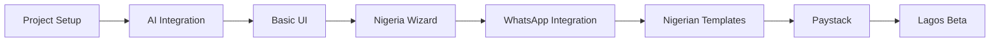

# Project Roadmap
# Buildr — Template-Only Implementation Timeline

> **Version**: 3.0 | **Updated**: December 8, 2024  
> **Approach**: Template-Only (non-technical users)  
> **Target Market**: Nigeria 🇳🇬

---

## Overview

This roadmap outlines the development phases for Buildr, the template-based landing page builder specifically for Nigerian real estate agencies.

**Total Timeline**: 8 weeks to MVP, then ongoing development

---

## Phase 1: Foundation (Weeks 1-2)

### Goals
- Set up project infrastructure
- Establish core AI generation pipeline
- Create basic UI shell with Nigeria focus

### Deliverables

| Task | Owner | Duration | Status |
|------|-------|----------|--------|
| Next.js 14 project setup | Frontend | 1 day | ✅ |
| TypeScript + Tailwind config | Frontend | 0.5 day | ✅ |
| shadcn/ui component installation | Frontend | 0.5 day | ✅ |
| Vercel AI SDK integration | Backend | 2 days | ✅ |
| Basic template → AI content enhancement | Backend | 3 days | ✅ |
| Streaming response handling | Full Stack | 2 days | ✅ |
| Simple prompt input UI | Frontend | 1 day | ✅ |
| Render API endpoint | Backend | 1 day | ✅ |

### Milestone: "Hello World Template"
- User selects template → sees customized preview
- Streaming content enhancement works end-to-end

---

## Phase 2: Template System + Nigeria (Weeks 3-4)

### Goals
- Implement template rendering system
- Build guided wizard flow
- Add Nigeria-specific form fields
- Create first 6 premium templates

### Deliverables

| Task | Owner | Duration | Status |
|------|-------|----------|--------|
| Template system architecture | Full Stack | 2 days | ✅ |
| Iframe preview integration | Frontend | 2 days | ✅ |
| **Guided Wizard UI (4-step flow)** | Frontend | 3 days | ✅ |
| **Template selector component** | Frontend | 1 day | ✅ |
| **Property details form** | Frontend | 2 days | ✅ |
| **Style picker component** | Frontend | 1 day | ✅ |
| **Nigerian property types data** | Backend | 1 day | ✅ |
| **Nigerian locations autocomplete** | Frontend | 1 day | |
| **Naira currency formatter** | Frontend | 0.5 day | ✅ |
| **Nigerian system prompt** | Backend | 0.5 day | ✅ |
| **Constrained prompt builder** | Backend | 1 day | ✅ |
| **Nigerian output validator** | Backend | 1 day | ✅ |
| **Create 3 Luxury templates** | Design | 3 days | ✅ |
| **Create 3 Standard templates** | Design | 2 days | ✅ |
| Form validation (Zod) | Backend | 1 day | ✅ |
| **UX Polish (Error States, Onboarding)** | Frontend | 2 days | ✅ |
| **Marketing Landing Page** | Frontend | 2 days | ✅ |

> **Reference**: See [16-TEMPLATE-DESIGN-SPEC.md](./16-TEMPLATE-DESIGN-SPEC.md) for template implementation details

### Milestone: "Nigeria-First Builder"
- Wizard generates Nigerian property pages
- Naira (₦) pricing and sqm measurements work
- Nigerian property types available
- **Post-generation validation rejects non-Nigerian content**

---

## Phase 3: WhatsApp + Templates (Weeks 5-6)

### Goals
- WhatsApp integration (critical for Nigeria)
- Create Nigerian template library
- Implement export functionality

### Deliverables

| Task | Owner | Duration | Status |
|------|-------|----------|--------|
| **WhatsApp click-to-chat integration** | Backend | 1 day | ✅ |
| **WhatsApp floating button component** | Frontend | 1 day | ✅ |
| **WhatsApp pre-filled messages** | Backend | 0.5 day | ✅ |
| Template data model & API | Backend | 2 days | ✅ |
| Template gallery UI | Frontend | 2 days | ✅ |
| **10 Nigerian templates** (see below) | Design + Frontend | 5 days |
| HTML export system | Backend | 2 days | ✅ |
| Zip download functionality | Backend | 1 day | ✅ |

### MVP Nigerian Templates

| Template | Priority |
|----------|----------|
| Standard Property Listing | P0 |
| Duplex Showcase | P0 |
| Land Sale Page | P0 |
| Agent Bio Page | P0 |
| Short-Let Apartment | P0 |
| Property Inspection Event | P0 |
| Off-Plan Estate | P1 |
| Team/Agency Page | P1 |
| Area Guide | P1 |
| Seller Services | P1 |

### Milestone: "WhatsApp-Ready Pages"
- All pages have WhatsApp CTA
- Nigerian templates accelerate generation
- Users can export usable landing pages

---

## Phase 4: Payment + Polish (Weeks 7-8)

### Goals
- Paystack payment integration
- Performance optimization
- Beta testing with Lagos agencies

### Deliverables

| Task | Owner | Duration | Status |
|------|-------|----------|--------|
| **Paystack integration** | Backend | 2 days | ✅ |
| **Subscription management** | Backend | 2 days | ✅ |
| **Naira pricing tiers** | Backend | 0.5 day | ✅ |
| Response caching (Redis) | Backend | 2 days | ✅ |
| Rate limiting implementation | Backend | 1 day | ✅ |
| Unit test coverage (75%) | All | 3 days | |
| E2E test suite | QA | 3 days | |
| **Beta testing (Lagos agencies)** | All | 3 days |

### Milestone: "MVP Launch Ready"
- Paystack payments working
- Nigerian agencies can sign up and pay
- Ready for Lagos market beta

---

## Post-MVP Roadmap (Nigeria Focus)

### Q1 After Launch

| Feature | Priority | Effort |
|---------|----------|--------|
| User authentication + profiles | High | 2 weeks | ✅ |
| Project saving/history | High | 2 weeks | ✅ |
| **WhatsApp Business API notifications** | High | 1 week |
| Additional templates (+10 Nigerian) | High | Ongoing |
| **Abuja market expansion** | High | 1 week |

### Q2 After Launch

| Feature | Priority | Effort |
|---------|----------|--------|
| **Instagram DM integration** | High | 2 weeks |
| Team collaboration | High | 3 weeks |
| **PropertyPro/NPC webhooks** | Medium | 2 weeks |
| Analytics dashboard | Medium | 2 weeks |
| **Port Harcourt market push** | Medium | 1 week |

### Q3 After Launch

| Feature | Priority | Effort |
|---------|----------|--------|
| **Multi-currency (₦, $, £)** | Medium | 2 weeks |
| API for integrations | Medium | 2 weeks |
| A/B testing | Low | 3 weeks |
| **Ghana expansion** | Low | 4 weeks |

---

## Key Dependencies

---

## Nigeria Market Milestones

| Week | Milestone | Validation |
|------|-----------|------------|
| 2 | First property page generated | Works with Naira |
| 4 | Wizard generates duplex page | Nigerian property types |
| 6 | WhatsApp CTA working | Click-to-chat functional |
| 7 | First Paystack payment | ₦5,000 subscription works |
| 8 | 10 Lagos agencies onboarded | Beta feedback collected |

---

## Risk Mitigation (Nigeria-Specific)

| Risk | Mitigation |
|------|------------|
| LLM generates USD/sqft | Strict prompt constraints, validation |
| Paystack integration fails | Flutterwave fallback ready |
| Slow mobile internet | Lazy loading, compressed assets |
| Users unfamiliar with AI | Guided wizard reduces friction |
| WhatsApp API limits | Rate limiting, queue system |

---

## Success Criteria for Nigeria MVP

| Metric | Target |
|--------|--------|
| Generation success rate | > 95% |
| Time to first preview | < 3 seconds |
| Full generation time | < 30 seconds |
| WhatsApp button clicks | Track all |
| Lagos beta signups | 25+ agencies |
| Paid conversion (beta) | > 10% |

---

## Budget Estimate (Nigeria MVP)

| Item | Monthly Cost |
|------|--------------|
| Vercel Pro | $20 |
| OpenAI API | ~$100 |
| Neon PostgreSQL | Free tier |
| Upstash Redis | ~$10 |
| Paystack | 1.5% + ₦100 per transaction |
| Domain + misc | ~$20 |
| **Total** | **~$150/month + transaction fees** |

---

> **Related**: [PRD](./01-PRD.md) | [Technical Spec](./02-TECHNICAL-SPEC.md)
