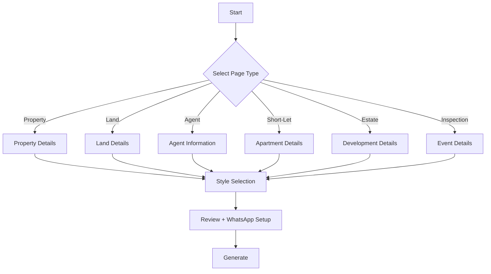

# Guided Prompt Flow Design
# Buildr — Nigerian Real Estate UI/UX & Frontend Spec

> **Version**: 2.0 | **Updated**: December 8, 2024  
> **Purpose**: Constrained, wizard-style prompt input for Nigerian real estate landing pages  
> **Target Market**: Nigeria 🇳🇬

---

## Table of Contents

1. [Design Philosophy](#1-design-philosophy)
2. [User Flow Overview](#2-user-flow-overview)
3. [Step-by-Step Wizard Design](#3-step-by-step-wizard-design)
4. [Nigeria-Specific Data](#4-nigeria-specific-data)
5. [Prompt Construction System](#5-prompt-construction-system)
6. [Frontend Technical Implementation](#6-frontend-technical-implementation)
7. [LLM Constraint Strategy](#7-llm-constraint-strategy)

---

## 1. Design Philosophy

### Problem Statement

Free-form text prompts lead to:
- **Cognitive overload**: Users don't know what to write
- **Non-Nigerian outputs**: LLM generates US-style homes, sqft, USD pricing
- **Wrong property types**: No understanding of duplexes, BQs, or C of O
- **Missing WhatsApp**: No click-to-chat integration

### Solution: Nigeria-Focused Guided Flow

Transform the prompt input into a **step-by-step wizard** that:
- ✅ Uses Nigerian property types (duplex, flat, terrace, land)
- ✅ Displays prices in Naira (₦)
- ✅ Measures in square meters (sqm)
- ✅ Includes Nigerian amenities (bore hole, BQ, generator house)
- ✅ Adds WhatsApp CTA by default
- ✅ Suggests Nigerian locations (Lekki, Maitama, GRA)

---

## 2. User Flow Overview

### High-Level Wizard Flow

```
┌─────────────────────────────────────────────────────────────────────────────┐
│                                                                             │
│   STEP 1          STEP 2          STEP 3          STEP 4        GENERATE   │
│   ─────────       ─────────       ─────────       ─────────     ─────────  │
│  Page Type   →   Details     →    Style      →   Review     →   Build!    │
│                                                                             │
│   • Listing       • Property       • Modern        • Preview      • Stream │
│   • Land Sale     • Land Info      • Luxury        • WhatsApp     • Refine │
│   • Agent Bio     • Agent Info     • Minimal       • Generate               │
│   • Short-Let     • Apartment      • Bold                                   │
│   • Estate        • Development                                             │
│                                                                             │
└─────────────────────────────────────────────────────────────────────────────┘
```

### Page Types for Nigeria



---

## 3. Step-by-Step Wizard Design

### Step 1: Page Type Selection (Nigeria)

```
┌─────────────────────────────────────────────────────────────────────────────┐
│  What would you like to create?                                             │
│                                                                             │
│  ┌─────────────┐  ┌─────────────┐  ┌─────────────┐  ┌─────────────┐        │
│  │   🏠        │  │   🏗️        │  │   🌍        │  │   🛏️        │        │
│  │             │  │             │  │             │  │             │        │
│  │  Property   │  │   Estate/   │  │   Land      │  │  Short-Let  │        │
│  │  Listing    │  │   Off-Plan  │  │   Sale      │  │  Apartment  │        │
│  └─────────────┘  └─────────────┘  └─────────────┘  └─────────────┘        │
│                                                                             │
│  ┌─────────────┐  ┌─────────────┐  ┌─────────────┐  ┌─────────────┐        │
│  │   👤        │  │   📅        │  │   📍        │  │   🏢        │        │
│  │             │  │             │  │             │  │             │        │
│  │   Agent     │  │ Inspection  │  │   Area      │  │   Agency    │        │
│  │   Profile   │  │   Booking   │  │   Guide     │  │   About     │        │
│  └─────────────┘  └─────────────┘  └─────────────┘  └─────────────┘        │
│                                                                             │
│                                              [ Continue →]                  │
└─────────────────────────────────────────────────────────────────────────────┘
```

---

### Step 2A: Property Listing Details (Nigeria)

```
┌─────────────────────────────────────────────────────────────────────────────┐
│  Property Details                                            Step 2 of 4   │
│                                                                             │
│  ┌────────────────────────────────┐  ┌────────────────────────────────┐    │
│  │ Property Type                  │  │ Price (₦)                      │    │
│  │ ┌──────────────────────────┐   │  │ ┌──────────────────────────┐   │    │
│  │ │ Detached Duplex       ▼  │   │  │ │ ₦ 85,000,000             │   │    │
│  │ └──────────────────────────┘   │  │ └──────────────────────────┘   │    │
│  │ • Detached Duplex              │  │   ○ For Sale  ○ For Rent       │    │
│  │ • Semi-Detached Duplex         │  │                                │    │
│  │ • Terrace Duplex               │  │   Rent: ₦/year                 │    │
│  │ • Flat (1BR / 2BR / 3BR)       │  └────────────────────────────────┘    │
│  │ • Bungalow                     │                                        │
│  │ • Self-Contain                 │                                        │
│  │ • Mansion                      │                                        │
│  └────────────────────────────────┘                                        │
│                                                                             │
│  ┌────────────┐  ┌────────────┐  ┌────────────┐  ┌────────────┐            │
│  │  Bedrooms  │  │ Bathrooms  │  │  Size (sqm)│  │   Parking  │            │
│  │ ┌────────┐ │  │ ┌────────┐ │  │ ┌────────┐ │  │ ┌────────┐ │            │
│  │ │   4  ▼ │ │  │ │  4   ▼ │ │  │ │  350   │ │  │ │  3   ▼ │ │            │
│  │ └────────┘ │  │ └────────┘ │  │ └────────┘ │  │ └────────┘ │            │
│  └────────────┘  └────────────┘  └────────────┘  └────────────┘            │
│                                                                             │
│  ┌─────────────────────────────────────────────────────────────────────┐   │
│  │ Location                                                             │   │
│  │ ┌──────────────────────────────┐ ┌─────────────────────────────────┐│   │
│  │ │ City: Lagos              ▼   │ │ Area: Lekki Phase 1          ▼ ││   │
│  │ └──────────────────────────────┘ └─────────────────────────────────┘│   │
│  └─────────────────────────────────────────────────────────────────────┘   │
│                                                                             │
│  ┌─────────────────────────────────────────────────────────────────────┐   │
│  │ Key Features (select up to 8)                                        │   │
│  │                                                                       │   │
│  │ [✓] Bore Hole     [✓] Generator House   [✓] Boys Quarters (BQ)      │   │
│  │ [✓] Security Post [ ] CCTV              [ ] Electric Fence          │   │
│  │ [✓] Interlocked   [ ] Swimming Pool     [ ] Fitted Kitchen          │   │
│  │ [ ] POP Ceiling   [✓] All Rooms Ensuite [ ] Tarred Road Access      │   │
│  │ [ ] Gated Estate  [ ] Serviced          [ ] Newly Built             │   │
│  └─────────────────────────────────────────────────────────────────────┘   │
│                                                                             │
│  [← Back]                                        [ Continue →]              │
└─────────────────────────────────────────────────────────────────────────────┘
```

---

### Step 2B: Land Sale Details (Nigeria)

```
┌─────────────────────────────────────────────────────────────────────────────┐
│  Land Details                                                Step 2 of 4   │
│                                                                             │
│  ┌────────────────────────────────┐  ┌────────────────────────────────┐    │
│  │ Plot Size                      │  │ Price (₦)                      │    │
│  │ ┌────────────────┐ sqm         │  │ ┌──────────────────────────┐   │    │
│  │ │      500       │             │  │ │ ₦ 45,000,000             │   │    │
│  │ └────────────────┘             │  │ └──────────────────────────┘   │    │
│  │ OR: 30m × 40m  (Dimensions)    │  │                                │    │
│  └────────────────────────────────┘  └────────────────────────────────┘    │
│                                                                             │
│  ┌─────────────────────────────────────────────────────────────────────┐   │
│  │ Document Status                                                      │   │
│  │                                                                       │   │
│  │ ● C of O (Certificate of Occupancy)     ○ Excision                   │   │
│  │ ○ Governor's Consent                    ○ Gazette                    │   │
│  │ ○ Survey Plan Only                      ○ Deed of Assignment         │   │
│  └─────────────────────────────────────────────────────────────────────┘   │
│                                                                             │
│  ┌─────────────────────────────────────────────────────────────────────┐   │
│  │ Location                                                             │   │
│  │ ┌──────────────────────────────┐ ┌─────────────────────────────────┐│   │
│  │ │ City: Abuja              ▼   │ │ Area: Gwarimpa              ▼  ││   │
│  │ └──────────────────────────────┘ └─────────────────────────────────┘│   │
│  │                                                                       │   │
│  │ Estate/Scheme Name (optional):  ____________________________         │   │
│  └─────────────────────────────────────────────────────────────────────┘   │
│                                                                             │
│  ┌─────────────────────────────────────────────────────────────────────┐   │
│  │ Land Features                                                        │   │
│  │                                                                       │   │
│  │ [✓] Fenced       [ ] Corner Piece      [✓] Dry Land                 │   │
│  │ [ ] Waterfront   [✓] Tarred Road       [ ] Near Major Landmark      │   │
│  │ [ ] Gated Estate [ ] Commercial Use OK  [ ] Residential Only        │   │
│  └─────────────────────────────────────────────────────────────────────┘   │
│                                                                             │
│  [← Back]                                        [ Continue →]              │
└─────────────────────────────────────────────────────────────────────────────┘
```

---

### Step 2C: Short-Let Apartment Details

```
┌─────────────────────────────────────────────────────────────────────────────┐
│  Short-Let Apartment                                         Step 2 of 4   │
│                                                                             │
│  ┌────────────────────────────────┐  ┌────────────────────────────────┐    │
│  │ Apartment Type                 │  │ Max Guests                     │    │
│  │ ┌──────────────────────────┐   │  │ ┌──────────────────────────┐   │    │
│  │ │ 2 Bedroom Apartment   ▼  │   │  │ │ 4                     ▼  │   │    │
│  │ └──────────────────────────┘   │  │ └──────────────────────────┘   │    │
│  └────────────────────────────────┘  └────────────────────────────────┘    │
│                                                                             │
│  ┌──────────────────────────── PRICING ────────────────────────────────┐   │
│  │                                                                      │   │
│  │  Per Night (₦)    Weekly Rate (₦)     Monthly Rate (₦)              │   │
│  │  ┌────────────┐   ┌────────────┐      ┌────────────┐                │   │
│  │  │   50,000   │   │  280,000   │      │  900,000   │                │   │
│  │  └────────────┘   └────────────┘      └────────────┘                │   │
│  └──────────────────────────────────────────────────────────────────────┘   │
│                                                                             │
│  ┌─────────────────────────────────────────────────────────────────────┐   │
│  │ Amenities                                                            │   │
│  │                                                                       │   │
│  │ [✓] WiFi          [✓] Netflix/DSTV    [✓] Air Conditioning          │   │
│  │ [✓] Generator     [✓] Water Supply    [ ] Swimming Pool             │   │
│  │ [ ] Gym           [✓] Kitchen         [✓] 24/7 Security             │   │
│  │ [ ] Workspace     [ ] Washer/Dryer    [✓] Parking                   │   │
│  └─────────────────────────────────────────────────────────────────────┘   │
│                                                                             │
│  ┌─────────────────────────────────────────────────────────────────────┐   │
│  │ Location                                                             │   │
│  │ ┌──────────────────────────────┐ ┌─────────────────────────────────┐│   │
│  │ │ City: Lagos              ▼   │ │ Area: Victoria Island        ▼ ││   │
│  │ └──────────────────────────────┘ └─────────────────────────────────┘│   │
│  └─────────────────────────────────────────────────────────────────────┘   │
│                                                                             │
│  [← Back]                                        [ Continue →]              │
└─────────────────────────────────────────────────────────────────────────────┘
```

---

### Step 2D: Agent Profile Details (Nigeria)

```
┌─────────────────────────────────────────────────────────────────────────────┐
│  Agent Information                                           Step 2 of 4   │
│                                                                             │
│  ┌─────────────────────────────┐  ┌─────────────────────────────────────┐  │
│  │ Agent Name                  │  │ Title / Role                        │  │
│  │ ┌─────────────────────────┐ │  │ ┌─────────────────────────────────┐ │  │
│  │ │ Chibuzo Okeke           │ │  │ │ Principal Partner            ▼  │ │  │
│  │ └─────────────────────────┘ │  │ └─────────────────────────────────┘ │  │
│  └─────────────────────────────┘  └─────────────────────────────────────┘  │
│                                                                             │
│  ┌─────────────────────────────────────────────────────────────────────┐   │
│  │ Experience Level                                                     │   │
│  │   ○ New Agent (0-2 years)                                            │   │
│  │   ● Experienced (3-10 years)                                         │   │
│  │   ○ Veteran (10+ years)                                              │   │
│  └─────────────────────────────────────────────────────────────────────┘   │
│                                                                             │
│  ┌─────────────────────────────────────────────────────────────────────┐   │
│  │ Certifications (select all that apply)                               │   │
│  │                                                                       │   │
│  │ [ ] NIESV Member   [ ] REDAN Member    [ ] Estate Surveyor License  │   │
│  │ [ ] AREF Member    [ ] NIM Member                                    │   │
│  └─────────────────────────────────────────────────────────────────────┘   │
│                                                                             │
│  ┌─────────────────────────────────────────────────────────────────────┐   │
│  │ Specialties (select up to 4)                                         │   │
│  │                                                                       │   │
│  │ [✓] Luxury Homes  [✓] Land Sales       [ ] Short-Let Management     │   │
│  │ [ ] Commercial    [ ] Off-Plan/Estates [✓] Rental Properties        │   │
│  │ [ ] Diaspora      [✓] First-Time Buyers[ ] Property Management      │   │
│  └─────────────────────────────────────────────────────────────────────┘   │
│                                                                             │
│  ┌─────────────────────────────────────────────────────────────────────┐   │
│  │ Service Areas                                                        │   │
│  │ ┌───────────────────────────────────────────────────────────────┐   │   │
│  │ │ Lekki, Ikoyi, Victoria Island, Ajah                           │   │   │
│  │ └───────────────────────────────────────────────────────────────┘   │   │
│  └─────────────────────────────────────────────────────────────────────┘   │
│                                                                             │
│  [← Back]                                        [ Continue →]              │
└─────────────────────────────────────────────────────────────────────────────┘
```

---

### Step 3: Style & WhatsApp Setup

```
┌─────────────────────────────────────────────────────────────────────────────┐
│  Choose Your Style                                           Step 3 of 4   │
│                                                                             │
│  ┌──────────────────────────── STYLE ────────────────────────────────┐     │
│  │                                                                    │     │
│  │  ┌─────────────┐  ┌─────────────┐  ┌─────────────┐  ┌───────────┐ │     │
│  │  │ ┌─────────┐ │  │ ┌─────────┐ │  │ ┌─────────┐ │  │ ┌───────┐ │ │     │
│  │  │ │ Preview │ │  │ │ Preview │ │  │ │ Preview │ │  │ │Preview│ │ │     │
│  │  │ └─────────┘ │  │ └─────────┘ │  │ └─────────┘ │  │ └───────┘ │ │     │
│  │  │             │  │             │  │             │  │           │ │     │
│  │  │  ● Modern   │  │  ○ Luxury   │  │  ○ Minimal  │  │  ○ Bold   │ │     │
│  │  │   Clean     │  │   Elegant   │  │   Simple    │  │ Dramatic  │ │     │
│  │  └─────────────┘  └─────────────┘  └─────────────┘  └───────────┘ │     │
│  └────────────────────────────────────────────────────────────────────┘     │
│                                                                             │
│  ┌──────────────────────────── WHATSAPP ─────────────────────────────┐     │
│  │                                                                    │     │
│  │  WhatsApp Number (required for Nigerian pages):                    │     │
│  │  ┌───────────┐ ┌────────────────────────────────────────────────┐ │     │
│  │  │ +234    ▼ │ │ 8012345678                                     │ │     │
│  │  └───────────┘ └────────────────────────────────────────────────┘ │     │
│  │                                                                    │     │
│  │  Pre-filled message:                                               │     │
│  │  ┌────────────────────────────────────────────────────────────┐   │     │
│  │  │ Hello! I'm interested in the 4BR Duplex in Lekki Phase 1   │   │     │
│  │  └────────────────────────────────────────────────────────────┘   │     │
│  │                                                                    │     │
│  │  [✓] Show floating WhatsApp button                                 │     │
│  │  [✓] Include WhatsApp in contact section                           │     │
│  └────────────────────────────────────────────────────────────────────┘     │
│                                                                             │
│  ┌──────────────────────────── BRAND ────────────────────────────────┐     │
│  │                                                                    │     │
│  │  Primary: [#1a365d]  Secondary: [#2c5282]  Accent: [#d4af37]       │     │
│  │                                                                    │     │
│  │  Company Logo: [ Upload Logo ]  [ Skip for now ]                   │     │
│  └────────────────────────────────────────────────────────────────────┘     │
│                                                                             │
│  [← Back]                                        [ Continue →]              │
└─────────────────────────────────────────────────────────────────────────────┘
```

---

### Step 4: Review & Generate (Nigeria)

```
┌─────────────────────────────────────────────────────────────────────────────┐
│  Review Your Page                                            Step 4 of 4   │
│                                                                             │
│  ┌─────────────────────────────────────────────────────────────────────┐   │
│  │   📋 PAGE SUMMARY                                                     │   │
│  │   ──────────────────────────────────────────────────────────────     │   │
│  │                                                                       │   │
│  │   Type:     Property Listing                               [Edit]    │   │
│  │   ──────────────────────────────────────────────────────────────     │   │
│  │   Property: 4 bed, 4 bath, 350 sqm Detached Duplex         [Edit]    │   │
│  │   Price:    ₦85,000,000 (For Sale)                                   │   │
│  │   Location: Lekki Phase 1, Lagos                                     │   │
│  │   Features: Bore Hole, Generator House, BQ, Security Post,           │   │
│  │             Interlocked Compound, All Rooms Ensuite                  │   │
│  │   ──────────────────────────────────────────────────────────────     │   │
│  │   Style:    Modern Clean                                   [Edit]    │   │
│  │   WhatsApp: +234 801 234 5678                                        │   │
│  │                                                                       │   │
│  └─────────────────────────────────────────────────────────────────────┘   │
│                                                                             │
│  ┌───────────────────────── SECTIONS TO BE GENERATED ──────────────────┐   │
│  │                                                                       │   │
│  │  ┌───────────────────┐  ┌───────────────┐  ┌───────────────┐        │   │
│  │  │  🖼️ Hero Section │  │ 📊 Stats Bar  │  │ 🖼️ Gallery   │        │   │
│  │  │  with property   │  │ ₦ Price, Beds │  │ Photo grid    │        │   │
│  │  │  image           │  │ Baths, Sqm    │  │ with lightbox │        │   │
│  │  └───────────────────┘  └───────────────┘  └───────────────┘        │   │
│  │  ┌───────────────────┐  ┌───────────────┐  ┌───────────────┐        │   │
│  │  │ 📝 Description   │  │ ✅ Features   │  │ 📍 Location   │        │   │
│  │  │ Property details │  │ Nigerian      │  │ Map & address │        │   │
│  │  │                  │  │ amenities     │  │               │        │   │
│  │  └───────────────────┘  └───────────────┘  └───────────────┘        │   │
│  │  ┌───────────────────┐  ┌───────────────────────────────────┐       │   │
│  │  │ 💬 WhatsApp CTA  │  │ 📧 Inquiry Form                   │       │   │
│  │  │ Click-to-chat    │  │ + Agent contact card              │       │   │
│  │  └───────────────────┘  └───────────────────────────────────┘       │   │
│  └─────────────────────────────────────────────────────────────────────┘   │
│                                                                             │
│  [← Back]                              [ ✨ Generate Landing Page ]         │
│                                                                             │
└─────────────────────────────────────────────────────────────────────────────┘
```

---

## 4. Nigeria-Specific Data

### 4.1 Property Types

```typescript
const NIGERIA_PROPERTY_TYPES = [
  { id: 'detached_duplex', label: 'Detached Duplex' },
  { id: 'semi_detached_duplex', label: 'Semi-Detached Duplex' },
  { id: 'terrace_duplex', label: 'Terrace Duplex' },
  { id: 'flat_1br', label: 'Flat (1 Bedroom)' },
  { id: 'flat_2br', label: 'Flat (2 Bedroom)' },
  { id: 'flat_3br', label: 'Flat (3 Bedroom)' },
  { id: 'bungalow', label: 'Bungalow' },
  { id: 'self_contain', label: 'Self-Contain' },
  { id: 'mansion', label: 'Mansion' },
  { id: 'penthouse', label: 'Penthouse' },
  { id: 'maisonette', label: 'Maisonette' },
];
```

### 4.2 Nigerian Locations

```typescript
const NIGERIA_LOCATIONS = {
  Lagos: [
    'Lekki Phase 1', 'Lekki Phase 2', 'Chevron', 'Ikate', 'Osapa London',
    'Ikoyi', 'Banana Island', 'Victoria Island', 'Ajah', 'Sangotedo',
    'Ikeja GRA', 'Magodo', 'Maryland', 'Surulere', 'Yaba',
    'Gbagada', 'Anthony', 'Ogudu', 'Ojodu', 'Omole',
  ],
  Abuja: [
    'Maitama', 'Asokoro', 'Wuse', 'Wuse 2', 'Garki',
    'Gwarimpa', 'Jabi', 'Katampe', 'Life Camp', 'Utako',
    'Mabushi', 'Lugbe', 'Kubwa', 'Nyanya', 'Karu',
  ],
  'Port Harcourt': [
    'GRA Phase 1', 'GRA Phase 2', 'Trans Amadi', 'Rumuola',
    'Old GRA', 'Peter Odili Road', 'Eliozu', 'Rukpokwu',
  ],
  Ibadan: [
    'Bodija', 'UI Area', 'Jericho', 'Ring Road', 'Oluyole',
    'Agodi GRA', 'Iyaganku', 'Samonda',
  ],
};
```

### 4.3 Nigerian Property Features

```typescript
const NIGERIA_PROPERTY_FEATURES = [
  // Water & Power
  { id: 'borehole', label: 'Bore Hole', category: 'utilities' },
  { id: 'generator_house', label: 'Generator House', category: 'utilities' },
  { id: 'solar', label: 'Solar Panels', category: 'utilities' },
  { id: 'inverter', label: 'Inverter System', category: 'utilities' },
  { id: 'prepaid_meter', label: 'Prepaid Meter', category: 'utilities' },
  
  // Security
  { id: 'security_post', label: 'Security Post', category: 'security' },
  { id: 'cctv', label: 'CCTV Security', category: 'security' },
  { id: 'perimeter_fence', label: 'Perimeter Fencing', category: 'security' },
  { id: 'electric_fence', label: 'Electric Fence', category: 'security' },
  { id: 'gated_estate', label: 'Gated Estate', category: 'security' },
  
  // Compound
  { id: 'bq', label: 'Boys Quarters (BQ)', category: 'compound' },
  { id: 'parking', label: 'Parking Space', category: 'compound' },
  { id: 'interlocked', label: 'Interlocked Compound', category: 'compound' },
  { id: 'garden', label: 'Garden', category: 'compound' },
  
  // Interior
  { id: 'fitted_kitchen', label: 'Fitted Kitchen', category: 'interior' },
  { id: 'pop_ceiling', label: 'POP Ceiling', category: 'interior' },
  { id: 'ensuite', label: 'All Rooms Ensuite', category: 'interior' },
  { id: 'ac', label: 'Air Conditioning', category: 'interior' },
  { id: 'walk_in_closet', label: 'Walk-in Closet', category: 'interior' },
  
  // Recreation
  { id: 'pool', label: 'Swimming Pool', category: 'recreation' },
  { id: 'gym', label: 'Gym', category: 'recreation' },
  
  // Access
  { id: 'tarred_road', label: 'Tarred Road Access', category: 'access' },
  { id: 'serviced', label: 'Serviced Estate', category: 'access' },
  { id: 'newly_built', label: 'Newly Built', category: 'condition' },
];
```

### 4.4 Land Document Types

```typescript
const NIGERIA_LAND_DOCUMENTS = [
  { id: 'c_of_o', label: 'C of O (Certificate of Occupancy)', trusted: true },
  { id: 'governors_consent', label: "Governor's Consent", trusted: true },
  { id: 'survey', label: 'Survey Plan', trusted: false },
  { id: 'deed_of_assignment', label: 'Deed of Assignment', trusted: false },
  { id: 'excision', label: 'Excision', trusted: true },
  { id: 'gazette', label: 'Gazette', trusted: true },
  { id: 'r_of_o', label: 'R of O (Right of Occupancy)', trusted: false },
];
```

### 4.5 Agent Certifications

```typescript
const NIGERIA_AGENT_CERTIFICATIONS = [
  { id: 'niesv', label: 'NIESV (Nigerian Institution of Estate Surveyors and Valuers)' },
  { id: 'redan', label: 'REDAN (Real Estate Developers Association of Nigeria)' },
  { id: 'aref', label: 'AREF (Association of Real Estate Firms)' },
  { id: 'esvarbon', label: 'ESVARBON (Estate Surveyors and Valuers Registration Board)' },
  { id: 'nim', label: 'NIM (Nigerian Institute of Management)' },
];
```

---

## 5. Prompt Construction System

### 5.1 Nigeria-Focused Prompt Builder

```typescript
export function buildNigerianPrompt(data: WizardData): string {
  const { pageType, content, style, whatsapp } = data;
  
  return `
## STRICT REQUIREMENTS
You are generating a ${pageType.toUpperCase()} page for NIGERIAN real estate.
This is for the NIGERIA market. Use Nigerian context throughout.

## NIGERIA-SPECIFIC REQUIREMENTS
- Display all prices in Nigerian Naira (₦) with proper formatting (e.g., ₦85,000,000)
- Use square meters (sqm), not square feet
- Include WhatsApp click-to-chat button with number: ${whatsapp.number}
- Use Nigerian property terminology (duplex, flat, BQ, bore hole, etc.)
- Reference Nigerian locations correctly

## PAGE TYPE: ${getPageTypeLabel(pageType)}
${getPageTypeInstructions(pageType)}

## REQUIRED SECTIONS (in this order):
${getRequiredSections(pageType).map((s, i) => `${i + 1}. ${s}`).join('\n')}

## CONTENT DATA
${formatNigerianContentData(pageType, content)}

## WHATSAPP INTEGRATION
- Phone: ${whatsapp.number}
- Pre-filled message: "${whatsapp.message}"
- Show floating WhatsApp button: ${whatsapp.showFloating}
- WhatsApp link format: https://wa.me/234${whatsapp.number.replace(/^0/, '')}?text=${encodeURIComponent(whatsapp.message)}

## STYLE REQUIREMENTS
- Visual Style: ${style.preset}
${style.customColors ? `- Primary: ${style.customColors.primary}
- Secondary: ${style.customColors.secondary}
- Accent: ${style.customColors.accent}` : ''}

## CONSTRAINTS
- MUST use Nigerian Naira (₦) for all prices
- MUST use square meters (sqm) for measurements
- MUST include WhatsApp button
- Use ONLY the data provided
- Nigerian property features only
- Do NOT use American real estate terms (sqft, HOA, etc.)
`.trim();
}
```

### 5.2 Section Requirements by Page Type

```typescript
function getRequiredSections(pageType: PageType): string[] {
  const sections: Record<PageType, string[]> = {
    listing: [
      'Hero with full-width property image',
      'Stats bar (₦ price, beds, baths, sqm)',
      'Photo gallery grid',
      'Property description',
      'Features grid with Nigerian amenities',
      'Location section',
      'WhatsApp CTA button (prominent)',
      'Agent card with contact form',
    ],
    land: [
      'Hero with land/aerial image',
      'Plot specs (size sqm, price, price/sqm)',
      'Document status section (C of O, etc.)',
      'Location advantages',
      'Investment highlights',
      'WhatsApp inquiry button',
      'Contact form',
    ],
    agent: [
      'Hero with professional photo',
      'About/Bio section',
      'Nigerian certifications (NIESV, REDAN)',
      'Specialties',
      'Service areas',
      'Testimonials',
      'WhatsApp contact (prominent)',
    ],
    shortlet: [
      'Apartment gallery hero',
      'Specs (beds, max guests)',
      'Pricing table (₦/night, ₦/week, ₦/month)',
      'Amenities grid',
      'House rules',
      'Location highlights',
      'WhatsApp booking button',
    ],
    estate: [
      'Development hero with renders',
      'Available units grid',
      'Floor plans',
      'Estate amenities',
      'Payment plan section',
      'Registration form',
      'Developer info',
    ],
    inspection: [
      'Property preview',
      'Date/time options',
      'RSVP form',
      'Property highlights',
      'Agent info',
      'WhatsApp + directions',
    ],
  };
  
  return sections[pageType] || [];
}
```

---

## 6. Frontend Technical Implementation

### 6.1 Updated State Types for Nigeria

```typescript
interface NigerianListingData {
  propertyType: PropertyType;
  price: number;  // In Naira
  priceType: 'sale' | 'rent';
  rentPeriod?: 'yearly' | 'monthly';
  beds: number;
  baths: number;
  sqm: number;  // Square meters
  parking: number;
  city: string;
  area: string;
  estate?: string;
  features: string[];
  notes?: string;
}

interface NigerianLandData {
  plotSize: number;  // sqm
  dimensions?: { width: number; length: number };
  price: number;  // Naira
  pricePerSqm: number;
  documentType: DocumentType;
  city: string;
  area: string;
  scheme?: string;
  features: string[];
}

interface WhatsAppConfig {
  countryCode: string;  // +234
  number: string;
  message: string;
  showFloating: boolean;
  showInContact: boolean;
}
```

### 6.2 Naira Price Formatter

```typescript
export function formatNaira(amount: number): string {
  return new Intl.NumberFormat('en-NG', {
    style: 'currency',
    currency: 'NGN',
    minimumFractionDigits: 0,
    maximumFractionDigits: 0,
  }).format(amount);
}

// Usage: formatNaira(85000000) → "₦85,000,000"
```

### 6.3 WhatsApp Link Generator

```typescript
export function generateWhatsAppLink(config: WhatsAppConfig): string {
  const phone = config.number.replace(/^0/, '');
  const fullNumber = `234${phone}`;
  const encodedMessage = encodeURIComponent(config.message);
  
  return `https://wa.me/${fullNumber}?text=${encodedMessage}`;
}

// Usage: generateWhatsAppLink({ number: '08012345678', message: 'Hi!' })
// → "https://wa.me/2348012345678?text=Hi!"
```

---

## 7. LLM Constraint Strategy

### Nigeria-Specific Validation

```typescript
const NIGERIA_VALIDATION_RULES = {
  // Must have Naira
  hasCurrency: (code: string) => /₦|NGN|naira/i.test(code),
  
  // Must have WhatsApp
  hasWhatsApp: (code: string) => /wa\.me|whatsapp|whatsApp/i.test(code),
  
  // Must use sqm not sqft
  usesMetric: (code: string) => 
    /sqm|square\s*meter/i.test(code) && !/sqft|square\s*feet/i.test(code),
  
  // Nigerian property terms
  hasNigerianTerms: (code: string) =>
    /duplex|flat|bq|bore\s*hole|c\s*of\s*o/i.test(code),
  
  // No American terms
  noAmericanTerms: (code: string) =>
    !/MLS|HOA|escrow|realtor\.com|zillow/i.test(code),
};

export function validateNigerianOutput(code: string): ValidationResult {
  const errors: string[] = [];
  
  if (!NIGERIA_VALIDATION_RULES.hasCurrency(code)) {
    errors.push('Missing Naira (₦) currency formatting');
  }
  
  if (!NIGERIA_VALIDATION_RULES.hasWhatsApp(code)) {
    errors.push('Missing WhatsApp integration');
  }
  
  if (!NIGERIA_VALIDATION_RULES.usesMetric(code)) {
    errors.push('Should use square meters (sqm) not square feet');
  }
  
  if (!NIGERIA_VALIDATION_RULES.noAmericanTerms(code)) {
    errors.push('Contains American real estate terms');
  }
  
  return {
    valid: errors.length === 0,
    errors,
  };
}
```

---

> **Related Documents**:  
> - [PRD](./01-PRD.md)  
> - [Template Library](./08-TEMPLATE-LIBRARY.md)  
> - [User Personas](./04-USER-PERSONAS.md)
