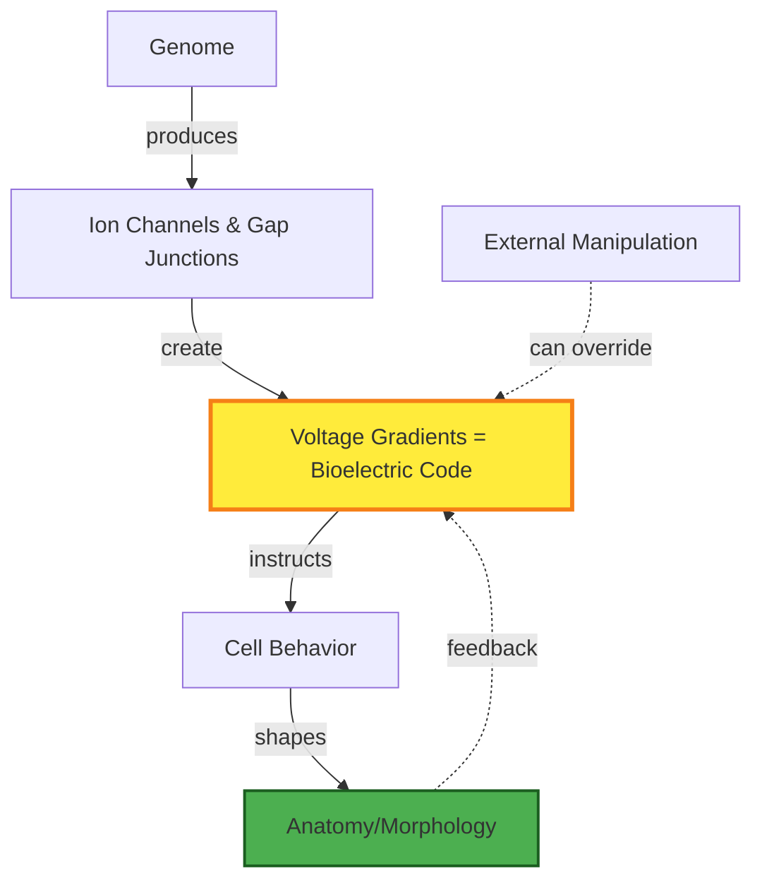

# Levin Study Vault - Concept Extraction & Knowledge Graph Builder

<objective>
Develop an automated system to extract key concepts from Michael Levin's papers, create atomic concept notes in Obsidian, and build knowledge graphs showing relationships between concepts. This enables progressive understanding by visualizing how ideas connect across 400+ papers.
</objective>

<context>
**Prerequisites:**
- Vault setup (prompt 003) ✓
- Papers organized (prompt 004) ✓
- NotebookLM summaries available (prompt 005) ✓

**Goal:** Transform linear paper reading into a connected knowledge web
**Method:** Combine AI-assisted extraction (Claude API) with manual curation
**Output:** Searchable concept network in Obsidian with visual graphs
</context>

<concept_extraction_strategy>
### Phase 1: Automated Concept Identification

**Data Sources for Extraction:**
1. Paper abstracts (from `20-literature-notes/summaries/`)
2. NotebookLM study guides (from `60-notebooklm-resources/generated-summaries/`)
3. Paper titles and keywords (from `10-papers/metadata.json`)

**Concept Categories (Levin's Research):**

```yaml
Bioelectricity:
  - Membrane voltage (Vmem)
  - Ion channels (gap junctions, voltage-gated)
  - Bioelectric code
  - Voltage gradients
  - Resting potential

Morphogenesis:
  - Pattern formation
  - Morphogenetic fields
  - Anterior-posterior axis
  - Left-right asymmetry
  - Scale-free patterning

Regeneration:
  - Blastema formation
  - Dedifferentiation
  - Positional information
  - Limb regeneration
  - Head regeneration (planaria)

Cognition & Agency:
  - Basal cognition
  - Cellular intelligence
  - Goal-directedness
  - Minimal cognition
  - Collective intelligence
  - Computational boundaries

Cancer & Disease:
  - Tumor suppression (bioelectric)
  - Oncogene normalization
  - Gap junction communication
  - Membrane voltage in cancer

Synthetic Biology:
  - Xenobots
  - Anthrobots
  - Self-assembly
  - Emergent morphology
  - Living machines

Cross-Domain Concepts:
  - Information theory
  - Cybernetics
  - Scale-free cognition
  - Multi-scale competency
  - Evolutionary biology
```

### Phase 2: Concept Note Structure

Each concept gets atomic note in `30-concept-notes/[category]/[concept-name].md`

**Template Enhancement (expanded from prompt 003):**
```markdown
---
concept: Bioelectric Code
aliases: [voltage code, bioelectric pattern, Vmem pattern]
category: bioelectricity
difficulty: intermediate
first_paper: [[Levin-2014-Morphogenetic-Fields]]
key_papers: 
  - [[Levin-2014-Morphogenetic-Fields]]
  - [[Pai-2015-Transmembrane-Voltage]]
related_concepts:
  - prerequisite: [[Membrane-Voltage]], [[Ion-Channels]]
  - builds_upon: [[Pattern-Formation]]
  - enables: [[Regenerative-Medicine]], [[Bioelectric-Tumor-Suppression]]
tags: [bioelectricity, information-theory, development]
---

## ELI15 Explanation
The "bioelectric code" is like software for your body. Just like computer programs use 1s and 0s, cells use electrical signals (positive/negative charges) to communicate and decide what to build. This electrical "program" tells cells whether to make an arm, a leg, or an eye—separate from DNA's instructions.

## Technical Definition
Bioelectric code refers to the spatiotemporal pattern of resting membrane voltage (Vmem) gradients across cell populations that acts as an instructive signal for morphogenesis, independent of genomic sequence. These voltage patterns encode positional information and influence gene expression through voltage-gated channels and gap junctions.

## Levin's Core Claim
> "Bioelectric signaling represents a software layer between the genome (hardware) and anatomy (phenotype), enabling rapid, scalable control of growth and form."  
> — *Morphogenetic Fields in Embryogenesis, Regeneration, and Cancer* (2014)

## Why This Matters
- **Regenerative Medicine:** Manipulating voltage patterns can trigger limb regrowth
- **Cancer Treatment:** Normalizing bioelectric code can suppress tumors without targeting DNA
- **AI/Robotics:** Principles apply to swarm intelligence and decentralized control

## Key Mechanisms
1. **Voltage Gradients → Gene Expression**
   - Membrane voltage changes → ion channel activity → transcription factors activate
   
2. **Gap Junction Networks**
   - Cells electrically coupled via connexins share bioelectric state
   - Creates "computational tissue" making collective decisions

3. **Bistability & Pattern Locks**
   - Voltage patterns can be self-reinforcing (positive feedback)
   - Creates stable developmental states

## Visual Representation


## Key Papers (Chronological)
1. **[[Levin-2003-Endogenous-Bioelectric]]** - First demonstration of Vmem controlling left-right asymmetry
2. **[[Pai-2012-Transmembrane-Voltage]]** - Vmem controls tumor suppression in Xenopus
3. **[[Levin-2014-Morphogenetic-Fields]]** - Comprehensive framework for bioelectric code
4. **[[Mathews-2017-Gap-Junctions]]** - Role of gap junctions in distributing voltage patterns

## Experimental Evidence
- **Planaria Head/Tail Regeneration:** Hyperpolarizing voltage induces head formation; depolarizing induces tail
- **Eye Induction:** Expressing voltage-gated channels in non-eye tissue → ectopic eye formation
- **Tumor Normalization:** Forced expression of connexins (gap junctions) normalizes cancer cells

## Connections to Other Concepts

### Prerequisites (understand first):
- [[Membrane-Voltage]] - Vmem basics
- [[Ion-Channels]] - Mechanisms of voltage change
- [[Gap-Junctions]] - Electrical coupling between cells

### Related Concepts:
- [[Morphogenetic-Fields]] - Bioelectric code IS the mechanism for fields
- [[Positional-Information]] - Voltage gradients encode position
- [[Cellular-Computation]] - Voltage networks perform calculations

### Enables/Applications:
- [[Regenerative-Medicine]] - Trigger regeneration via voltage manipulation
- [[Bioelectric-Tumor-Suppression]] - Cancer as bioelectric disorder
- [[Synthetic-Morphology]] - Design new body plans

## Cross-Domain Analogies
| Domain | Analogy |
|--------|---------|
| Computer Science | Bioelectric code = software layer between hardware (genes) and interface (anatomy) |
| Electrical Engineering | Voltage gradients = signal processing network with feedback loops |
| Information Theory | Vmem patterns = Shannon information encoding developmental state |
| Cybernetics | Bioelectric circuits = homeostatic control systems for morphology |

## Open Questions
- How is bioelectric code "read" and translated to gene expression?
- Can we write arbitrary bioelectric programs to design custom morphologies?
- What is the information capacity of bioelectric networks?
- How does bioelectric code evolve across species?

## Learning Pathway
**Beginner:** Start with [[Membrane-Voltage]] → [[Ion-Channels]] → this note  
**Next Steps:** [[Morphogenetic-Fields]] → [[Positional-Information]]  
**Advanced:** [[Cellular-Computation]] → [[Multi-Scale-Competency]]

## NotebookLM Q&A Highlights
> **Q:** How does bioelectric code differ from genetic code?  
> **A:** Genetic code (DNA) is slow-changing hardware; bioelectric code is dynamic software that rapidly adapts to injury/environment without changing genes. DNA makes the parts (channels, pumps); voltage patterns decide how to assemble them.

---
*Last updated: [auto-generated timestamp]*  
*Papers citing this concept: [auto-count from backlinks]*
```
</concept_extraction_strategy>

<implementation>
Create: `scripts/extract-concepts.py`

```python
import anthropic
import json
from pathlib import Path
import re

class ConceptExtractor:
    def __init__(self, vault_path, api_key):
        self.vault = Path(vault_path)
        self.client = anthropic.Anthropic(api_key=api_key)
        self.concept_dir = self.vault / "30-concept-notes"
        
    def extract_from_paper_note(self, paper_md_path):
        """
        Read paper summary note, use Claude to extract concepts
        Returns: list of {name, category, definition, difficulty}
        """
        paper_content = Path(paper_md_path).read_text()
        
        prompt = f"""
        Analyze this paper summary and extract key scientific concepts.
        For each concept, provide:
        1. Name (concise, 2-4 words)
        2. Category (bioelectricity, morphogenesis, regeneration, cognition, cancer, synthetic-bio)
        3. Simple definition (1 sentence, ELI15 level)
        4. Technical definition (1-2 sentences)
        5. Difficulty (foundational, intermediate, advanced)
        
        Paper summary:
        {paper_content}
        
        Output as JSON array.
        """
        
        response = self.client.messages.create(
            model="claude-3-5-sonnet-20241022",
            max_tokens=2000,
            messages=[{"role": "user", "content": prompt}]
        )
        
        concepts = json.loads(response.content[0].text)
        return concepts
    
    def find_concept_relationships(self, concept_name, all_concepts):
        """
        Use Claude to determine:
        - Prerequisites (concepts needed to understand this)
        - Related concepts (same level)
        - Enables (concepts built on this)
        """
        prompt = f"""
        Given the concept "{concept_name}" and this list of related concepts:
        {', '.join(all_concepts)}
        
        Categorize each concept as:
        - prerequisite: must understand before {concept_name}
        - related: same difficulty level, complementary
        - enables: concepts that build upon {concept_name}
        - unrelated
        
        Output as JSON.
        """
        # Call Claude API, parse relationships
        pass
    
    def generate_concept_note(self, concept_data, relationships):
        """
        Create markdown note using enhanced template
        Fill in: name, definitions, category, related concepts
        """
        template = self.vault / "70-templates/concept-note-template.md"
        # Fill template with concept_data
        # Add relationship links [[concept-name]]
        # Save to 30-concept-notes/[category]/[concept-name].md
        pass
    
    def build_concept_graph(self, all_concepts):
        """
        Generate Mermaid graph showing concept relationships
        Save to 40-connection-maps/concept-graphs/master-graph.md
        """
        mermaid = "graph TD\n"
        # For each concept, add nodes and edges
        # Use different colors/shapes for categories
        # prerequisite → solid arrow
        # related → dashed line
        # enables → bold arrow
        pass
    
    def create_concept_index(self):
        """
        Generate searchable index: 00-meta/concept-index.md
        Dataview table: | Concept | Category | Difficulty | Papers |
        """
        pass

# Execution workflow
def main():
    extractor = ConceptExtractor(
        vault_path="C:/AI2025/levin-research",
        api_key=os.getenv("ANTHROPIC_API_KEY")
    )
    
    # Process all paper notes
    paper_notes = Path("C:/AI2025/levin-research/20-literature-notes/summaries").glob("*.md")
    
    all_concepts = {}
    for paper in paper_notes:
        concepts = extractor.extract_from_paper_note(paper)
        for concept in concepts:
            if concept['name'] not in all_concepts:
                all_concepts[concept['name']] = concept
    
    # Find relationships between concepts
    for concept_name in all_concepts:
        relationships = extractor.find_concept_relationships(
            concept_name, 
            list(all_concepts.keys())
        )
        extractor.generate_concept_note(all_concepts[concept_name], relationships)
    
    # Generate master knowledge graph
    extractor.build_concept_graph(all_concepts)
    extractor.create_concept_index()
```

### Execution Steps

1. **Extract concepts from all papers:**
   ```bash
   python scripts/extract-concepts.py
   ```
   - Processes `20-literature-notes/summaries/*.md`
   - Uses Claude API to identify concepts
   - Deduplicates (merge similar concepts)

2. **Generate concept notes:**
   - Creates `30-concept-notes/[category]/[concept].md` for each unique concept
   - Fills enhanced template with extracted data

3. **Build relationships:**
   - Second Claude API pass to map prerequisites/related/enables
   - Creates [[wikilinks]] between concept notes

4. **Generate knowledge graphs:**
   - Master graph: `40-connection-maps/concept-graphs/master-graph.md`
   - Category-specific graphs (e.g., bioelectricity-graph.md)
   - Visual representation using Mermaid

5. **Create indices:**
   - `00-meta/concept-index.md` - searchable table (Dataview)
   - `00-meta/learning-pathways.md` - suggested reading orders

</implementation>

<output>
Create in vault:

**Scripts:**
- `scripts/extract-concepts.py` (main extraction engine)
- `scripts/build-knowledge-graph.py` (graph generator)
- Updated `scripts/requirements.txt` (add: anthropic, networkx)

**Concept Notes:**
- `30-concept-notes/bioelectricity/[50+ concepts].md`
- `30-concept-notes/morphogenesis/[40+ concepts].md`
- `30-concept-notes/regeneration/[35+ concepts].md`
- `30-concept-notes/cognition/[30+ concepts].md`
- `30-concept-notes/cancer/[20+ concepts].md`
- `30-concept-notes/synthetic-bio/[15+ concepts].md`

**Knowledge Graphs:**
- `40-connection-maps/concept-graphs/master-graph.md` (all concepts)
- `40-connection-maps/concept-graphs/bioelectricity-subgraph.md`
- `40-connection-maps/concept-graphs/regeneration-subgraph.md`
- [etc. for each category]

**Indices:**
- `00-meta/concept-index.md` (Dataview table of all concepts)
- `00-meta/learning-pathways.md` (beginner → intermediate → advanced paths)

**Documentation:**
- `00-meta/concept-extraction-howto.md` (how to run scripts, interpret graphs)
</output>

<success_criteria>
- [ ] Script successfully extracts 200+ unique concepts from papers
- [ ] All concepts organized by category (bioelectricity, morphogenesis, etc.)
- [ ] Concept notes include: ELI15 + technical definitions, key papers, relationships
- [ ] Master knowledge graph renders correctly in Obsidian (Mermaid)
- [ ] Concept index searchable with Dataview (filterable by category/difficulty)
- [ ] Learning pathways document suggests 3+ progression routes (beginner → advanced)
- [ ] Cross-references work: clicking [[bioelectric-code]] navigates to concept note
</success_criteria>

<verification>
1. Run extraction: `python scripts/extract-concepts.py`
2. Check concept count: `Get-ChildItem -Recurse "30-concept-notes/*.md" | Measure-Object`
3. Validate random sample of 10 concept notes:
   - Has ELI15 + technical definitions
   - Includes key papers backlinks
   - Relationships are logical (prerequisites make sense)
4. Open `master-graph.md` in Obsidian - confirm Mermaid renders
5. Test concept index Dataview query executes without errors
6. Follow a learning pathway: can you progress from foundational → advanced concepts smoothly?
</verification>

<advanced_features>
### Optional Enhancements

1. **Concept Frequency Analysis:**
   - Track which concepts appear in most papers
   - Identify "hub concepts" (highly connected)
   - Visualize as heatmap in knowledge graph

2. **Temporal Evolution Tracking:**
   - Show how concepts evolved over time (2000 → 2024)
   - Highlight paradigm shifts in Levin's thinking

3. **Cross-Domain Mapping:**
   - Link biological concepts to CS/engineering/physics analogies
   - Create "translation layer" for non-biologists

4. **Spaced Repetition Integration:**
   - Tag concepts by mastery level
   - Generate Anki flashcards for key definitions
   - Track learning progress over time
</advanced_features>
