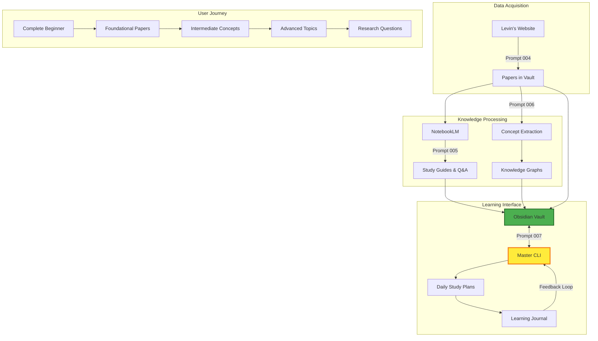

# Levin Study Vault - Master Orchestration & Learning Workflows

<objective>
Create the master control script and learning workflows that tie together all components (Obsidian vault, NotebookLM, concept graphs, Claude Code) into a cohesive system for studying Michael Levin's work. Provide executable commands, progress tracking, and adaptive learning pathways.
</objective>

<context>
**Prerequisites:** All previous prompts completed (003-006)
- ✓ Vault structure created
- ✓ Papers downloaded and organized
- ✓ NotebookLM integration configured
- ✓ Concept extraction system built

**This prompt delivers:**
- Master control dashboard (Obsidian MOC - Map of Content)
- CLI tool for running workflows
- Progress tracking system
- Adaptive learning recommendations
- Integration testing and validation
</context>

<master_control_dashboard>
### Home.md - Vault Entry Point

Create: `00-meta/HOME.md` (set as Obsidian start page)

```markdown
# Michael Levin Research - Learning Hub 🧬

> **Mission:** Master Levin's ideas on bioelectricity, regeneration, and cellular intelligence without a formal biology background.

---

## 📊 Progress Dashboard

```dataview
TABLE 
  status as "Status",
  difficulty as "Level",
  topics as "Topics"
FROM "20-literature-notes/summaries"
WHERE status = "reading" OR status = "summarized"
SORT status DESC
LIMIT 10
\```

**Papers Progress:** `= round(length(filter(file.tasks.completed, (t) => contains(t.text, "paper"))) / 400 * 100, 1)`%  
**Concepts Mastered:** `= length(filter(file.etags, (t) => contains(t, "mastered")))`  
**Study Hours:** [Track manually in learning journal]

---

## 🚀 Quick Actions

### New to Levin's Work? Start Here:
1. [[Learning-Roadmap]] - Suggested reading order
2. [[Foundational-Papers]] - Essential 10 papers to begin with
3. [[Key-Concepts-Overview]] - Core ideas explained simply

### Daily Workflows:
- [[Today's-Study-Plan]] - Auto-generated daily tasks
- [[Learning-Journal]] - Reflect on today's insights
- [[Questions-Bank]] - Track evolving questions

### Power Tools:
- [[NotebookLM-Workflow]] - How to use AI tutoring
- [[Concept-Explorer]] - Navigate knowledge graphs
- [[Paper-Search-Guide]] - Find papers by topic/concept

---

## 📚 Research Areas (Click to Explore)

| Area | Papers | Status | Next to Read |
|------|--------|--------|--------------|
| [[Bioelectricity\|🔋 Bioelectricity]] | `= length(filter(file.outlinks, (t) => contains(t.path, "10-papers/by-topic/bioelectricity")))` | [Progress bar] | [[Next-Bioelectricity-Paper]] |
| [[Regeneration\|🦎 Regeneration]] | `= ...` | [Progress bar] | [[Next-Regeneration-Paper]] |
| [[Morphogenesis\|🌱 Morphogenesis]] | --- | --- | --- |
| [[Basal-Cognition\|🧠 Basal Cognition]] | --- | --- | --- |
| [[Cancer-Geometry\|🎗️ Cancer as Geometry]] | --- | --- | --- |
| [[Xenobots\|🤖 Xenobots]] | --- | --- | --- |

---

## 🗺️ Knowledge Graph Explorer

**Most Connected Concepts:**
1. [[Bioelectric-Code]] (32 connections)
2. [[Membrane-Voltage]] (28 connections)
3. [[Gap-Junctions]] (24 connections)
4. [[Morphogenetic-Fields]] (21 connections)

**Visualizations:**
- [[Master-Concept-Graph]] - All concepts and relationships
- [[Learning-Pathway-Graph]] - Beginner → Advanced progression
- [[Paper-Citation-Network]] - How papers build on each other

---

## 🎯 Current Learning Focus

**This Week's Goal:** Understand bioelectric patterning in development

**Active Papers:**
- [ ] [[Pai-2015-Transmembrane-Voltage]] (reading)
- [ ] [[Levin-2014-Morphogenetic-Fields]] (to-read)

**Concepts to Master:**
- [ ] [[Bioelectric-Code]] (in-progress)
- [ ] [[Voltage-Gradients]] (to-start)

**NotebookLM Sessions:**
- [Bioelectricity Fundamentals Q&A](60-notebooklm-resources/qa-sessions/bioelectricity-2025-01-15.md)

---

## 🛠️ System Tools

### Run Workflows (PowerShell):
```powershell
# Download new papers
.\scripts\download-levin-papers.ps1

# Extract concepts from recent papers
python scripts\extract-concepts.py --new-only

# Update knowledge graphs
python scripts\build-knowledge-graph.py

# Generate today's study plan
python scripts\generate-daily-plan.py
```

### Maintenance:
- [[System-Health-Check]] - Validate vault integrity
- [[Update-Scripts]] - Pull latest automation improvements
- [[Backup-Strategy]] - Protect your notes

---

## 📖 Learning Resources

**For Non-Biologists:**
- [[Biology-Primer]] - Essential background (cells, DNA, proteins)
- [[Physics-for-Biology]] - Electricity, diffusion, thermodynamics
- [[Math-for-Levin]] - Information theory, networks, dynamical systems

**Levin's Key Ideas (Simplified):**
- [[Software-Hardware-Anatomy-Analogy]] - Genes vs. bioelectricity
- [[Cells-as-Agents]] - Collective intelligence perspective
- [[Scale-Free-Cognition]] - Intelligence at all levels

**External Resources:**
- [Levin Lab YouTube](https://www.youtube.com/@drmichaellevin) - Lectures and talks
- [Levin's Essays](https://drmichaellevin.org/essays/) - Accessible writings
- [Recommended Books] - Background reading

---

## 🤝 Community & Discussion

- **Research Questions:** [[Open-Questions]] - Things even Levin doesn't know yet
- **Personal Insights:** [[My-Hypotheses]] - Your own theories and connections
- **Share Progress:** [Export study guides to share with others]

---

*Last vault update: `= date(now)`*  
*Papers processed: `= length(file.lists.outlinks)`/400+*
```

</master_control_dashboard>

<cli_orchestration_tool>
### Create: `scripts/levin.py` - Master CLI Controller

```python
#!/usr/bin/env python3
"""
Levin Research Vault - Master Control CLI
Orchestrates all workflows for studying Michael Levin's papers
"""

import click
import sys
from pathlib import Path
from datetime import datetime

VAULT_PATH = Path("C:/AI2025/levin-research")

@click.group()
def cli():
    """Michael Levin Research Vault - Master Control"""
    pass

@cli.command()
@click.option('--full', is_flag=True, help='Full setup (slow, first-time only)')
def setup(full):
    """Initialize vault structure and download papers"""
    click.echo("🚀 Setting up Levin Research Vault...")
    
    if full:
        # Run prompts 003-004
        click.echo("📁 Creating vault structure...")
        subprocess.run(["python", "scripts/setup-vault.py"])
        
        click.echo("📄 Downloading papers (this may take hours)...")
        subprocess.run(["python", "scripts/download-levin-papers.py"])
    else:
        click.echo("⚡ Quick setup - creating folders only...")
        subprocess.run(["python", "scripts/setup-vault.py", "--quick"])
    
    click.echo("✅ Setup complete! Open vault in Obsidian: " + str(VAULT_PATH))

@cli.command()
@click.argument('topic', required=False)
def notebooklm(topic):
    """Prepare papers for NotebookLM upload"""
    click.echo(f"📚 Preparing NotebookLM source set for: {topic or 'foundations'}")
    
    # Run prompt 005 workflow
    subprocess.run([
        "python", "scripts/prepare-notebooklm-set.py",
        "--topic", topic or "foundations"
    ])
    
    source_dir = VAULT_PATH / f"60-notebooklm-resources/source-sets/{topic}/"
    click.echo(f"\n✅ Source set ready at: {source_dir}")
    click.echo("📤 Upload these PDFs to NotebookLM:")
    click.echo(f"   notebooklm.google.com - Create new notebook")

@cli.command()
@click.option('--new-only', is_flag=True, help='Only process papers added since last run')
def extract(new_only):
    """Extract concepts and build knowledge graphs"""
    click.echo("🔍 Extracting concepts from papers...")
    
    # Run prompt 006 workflow
    cmd = ["python", "scripts/extract-concepts.py"]
    if new_only:
        cmd.append("--new-only")
    
    subprocess.run(cmd)
    
    click.echo("🗺️ Building knowledge graphs...")
    subprocess.run(["python", "scripts/build-knowledge-graph.py"])
    
    click.echo("✅ Concept extraction complete!")
    click.echo(f"   View: {VAULT_PATH}/40-connection-maps/concept-graphs/master-graph.md")

@cli.command()
def study():
    """Generate today's study plan"""
    click.echo("📖 Generating personalized study plan...")
    
    subprocess.run(["python", "scripts/generate-daily-plan.py"])
    
    today_file = VAULT_PATH / f"00-meta/daily-plans/{datetime.now().strftime('%Y-%m-%d')}.md"
    click.echo(f"✅ Study plan ready: {today_file}")

@cli.command()
def stats():
    """Show learning progress statistics"""
    click.echo("📊 Vault Statistics\n")
    
    # Count files
    papers = len(list((VAULT_PATH / "10-papers/by-year").rglob("*.pdf")))
    summaries = len(list((VAULT_PATH / "20-literature-notes/summaries").glob("*.md")))
    concepts = len(list((VAULT_PATH / "30-concept-notes").rglob("*.md")))
    
    click.echo(f"Papers downloaded: {papers}/400+")
    click.echo(f"Papers summarized: {summaries}/400+")
    click.echo(f"Concepts extracted: {concepts}")
    click.echo(f"Progress: {round(summaries/400*100, 1)}%")
    
    # Next recommendations
    click.echo("\n🎯 Recommendations:")
    if summaries < 10:
        click.echo("   Start with foundational papers (run: levin study)")
    elif concepts < 50:
        click.echo("   Extract more concepts (run: levin extract)")
    else:
        click.echo("   Explore knowledge graphs in Obsidian!")

@cli.command()
def health():
    """Check vault integrity and broken links"""
    click.echo("🩺 Running health check...")
    
    subprocess.run(["python", "scripts/vault-health-check.py"])

@cli.command()
@click.argument('query')
def search(query):
    """Search papers and concepts"""
    click.echo(f"🔎 Searching for: {query}")
    
    # Search across paper notes, concepts, summaries
    subprocess.run(["python", "scripts/search.py", query])

if __name__ == '__main__':
    cli()
```

### Install CLI Tool:
```powershell
# Make globally accessible
pip install -e .  # If setup.py exists
# OR add alias:
Set-Alias levin "python C:\AI2025\levin-research\scripts\levin.py"
```

</cli_orchestration_tool>

<adaptive_learning_workflows>
### Create: `scripts/generate-daily-plan.py`

```python
"""
Generates personalized daily study plan based on:
- Current progress (papers read, concepts mastered)
- Difficulty progression (don't jump to advanced too early)
- Topic diversity (don't get stuck in one area)
- Spaced repetition (review concepts periodically)
"""

class DailyPlanGenerator:
    def __init__(self, vault_path):
        self.vault = Path(vault_path)
        
    def analyze_current_state(self):
        """
        Read learning journal, concept notes to determine:
        - What topics user has covered
        - Current difficulty level (beginner/intermediate/advanced)
        - Concepts still weak (tagged 'needs-review')
        """
        pass
    
    def recommend_next_papers(self, n=3):
        """
        Suggest 1-3 papers to read today based on:
        1. Prerequisites satisfied (don't read advanced before foundational)
        2. Topic diversity (alternate between areas)
        3. User's learning goal (from 00-meta/learning-roadmap.md)
        """
        pass
    
    def recommend_concept_review(self):
        """
        Spaced repetition: suggest 3-5 concepts to review
        Priority: concepts tagged 'needs-review' or not seen in 7+ days
        """
        pass
    
    def generate_notebooklm_prompts(self):
        """
        Suggest 3 questions to ask NotebookLM based on current focus area
        """
        pass
    
    def create_daily_note(self, recommendations):
        """
        Generate markdown file: 00-meta/daily-plans/YYYY-MM-DD.md
        
        Format:
        - Papers to read today (with time estimates)
        - Concepts to review
        - NotebookLM Q&A prompts
        - Reflection prompts for learning journal
        """
        pass
```

</adaptive_learning_workflows>

<output>
Create in vault:

**Master Dashboard:**
- `00-meta/HOME.md` (set as Obsidian start page in settings)

**CLI Tool:**
- `scripts/levin.py` (master control CLI)
- `scripts/setup.py` (Python package config for global install)
- Updated `scripts/requirements.txt` (add: click, rich for CLI)

**Workflow Scripts:**
- `scripts/generate-daily-plan.py` (adaptive study recommendations)
- `scripts/prepare-notebooklm-set.py` (organize papers for upload)
- `scripts/vault-health-check.py` (broken links, missing files)
- `scripts/search.py` (vault-wide search)

**Documentation:**
- `00-meta/workflows-guide.md` (how to use CLI tool)
- `00-meta/troubleshooting.md` (common issues and fixes)

**Learning Tools:**
- `00-meta/daily-plans/` (folder for generated study plans)
- `00-meta/learning-journal-template.md` (daily reflection)
</output>

<usage_examples>
### Typical Day with the Levin Research System

**Morning (30 mins):**
```powershell
# Generate today's study plan
levin study

# Open Obsidian, review HOME.md dashboard
# Check "Today's Study Plan" - suggests 2 papers to read
```

**Study Session (2 hours):**
1. Read suggested paper PDF
2. Take notes in paper summary template
3. Upload to NotebookLM, ask clarifying questions
4. Copy NotebookLM summary to vault

**Afternoon (1 hour):**
```powershell
# Extract concepts from today's papers
levin extract --new-only

# Review updated knowledge graphs
# Study 3-5 concept notes (spaced repetition reminders)
```

**Evening (15 mins):**
- Update learning journal with insights
- Tag concepts as 'mastered' or 'needs-review'
- Check progress: `levin stats`

---

**Weekly Review (1 hour):**
```powershell
# Run vault health check
levin health

# Update learning roadmap based on progress
# Adjust focus area if needed (e.g., switch from bioelectricity → regeneration)
```

</usage_examples>

<success_criteria>
- [ ] HOME.md dashboard displays correctly in Obsidian
- [ ] CLI tool installs and all commands work (`levin --help`)
- [ ] `levin setup` successfully creates vault structure
- [ ] `levin study` generates valid daily study plan
- [ ] `levin extract` runs concept extraction pipeline
- [ ] `levin stats` shows accurate progress metrics
- [ ] `levin health` detects broken links/missing files
- [ ] Daily plan recommendations are logical (prerequisites satisfied)
- [ ] All workflow scripts have error handling and logging
</success_criteria>

<verification>
1. **CLI Installation:**
   ```powershell
   python scripts/levin.py --help  # Should show all commands
   ```

2. **End-to-End Workflow:**
   ```powershell
   levin setup --full  # Creates vault, downloads papers (~2-6 hours)
   levin notebooklm foundations  # Prepares first NotebookLM set
   # [Manually use NotebookLM with prepared papers]
   levin extract  # Extracts concepts from all papers (~30 mins)
   levin study  # Generates first daily plan
   levin stats  # Shows progress dashboard
   ```

3. **Obsidian Integration:**
   - Open vault in Obsidian
   - Set `00-meta/HOME.md` as start page (Settings → Files & Links)
   - Verify Dataview queries render
   - Click through knowledge graphs (should navigate correctly)

4. **Daily Usage Test:**
   - Run `levin study` for 7 consecutive days
   - Confirm recommendations change based on progress
   - Verify spaced repetition works (concepts resurface after 7 days)
</verification>

<integration_summary>
## Complete System Overview



**Prompts Execution Order:**
1. **003** - Setup vault structure
2. **004** - Download and organize papers
3. **005** - Configure NotebookLM workflow
4. **006** - Extract concepts and build graphs
5. **007** - Activate master orchestration (this prompt)

**Result:** Self-contained research system that augments learning without formal academic background.
</integration_summary>
