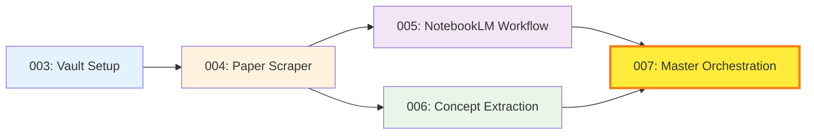

# Michael Levin Study System - Execution Guide

## Overview

This guide explains how to execute the 5-prompt system for studying Michael Levin's 400+ papers on regenerative biology, bioelectricity, and morphogenesis using Claude Code, NotebookLM, and Obsidian MD.

## System Architecture



## Prompts Created

| # | File | Purpose | Execution Mode | Est. Time |
|---|------|---------|----------------|-----------|
| 003 | `levin-vault-setup.md` | Create Obsidian vault structure | **Sequential** (run first) | 5 mins |
| 004 | `levin-paper-scraper.md` | Download & organize 400+ papers | **Sequential** (after 003) | 2-6 hours |
| 005 | `levin-notebooklm-workflow.md` | Setup NotebookLM integration | **Parallel** (after 004) | 30 mins |
| 006 | `levin-concept-extraction.md` | Extract concepts, build knowledge graphs | **Parallel** (after 004) | 1-2 hours |
| 007 | `levin-master-orchestration.md` | Create CLI tool & learning dashboard | **Sequential** (after 005+006) | 20 mins |

## Execution Strategy

### Phase 1: Foundation (Sequential)
```bash
# Run prompts 003 and 004 in order
/run-prompt 003 004
```
**Why sequential:** 004 requires the vault structure from 003

### Phase 2: Enhancement (Parallel)
```bash
# Run prompts 005 and 006 in parallel (they're independent)
/run-prompt 005,006
```
**Why parallel:** Both operate on papers from 004 but don't conflict

### Phase 3: Integration (Sequential)
```bash
# Run prompt 007 after 005 and 006 complete
/run-prompt 007
```
**Why sequential:** Integrates outputs from both 005 and 006

## Quick Start (Full System)

### Option A: Fully Automated (Recommended)
```bash
# Execute all prompts sequentially (safest)
/run-prompt 003 004 005 006 007
```
**Total time:** ~4-8 hours (mostly downloading papers in 004)

### Option B: Optimized (Advanced)
```bash
# Phase 1
/run-prompt 003 004

# Phase 2 (start after 004 completes)
/run-prompt 005,006

# Phase 3 (start after 005 and 006 complete)
/run-prompt 007
```
**Total time:** ~3-6 hours (parallelization saves ~1-2 hours)

## What Each Prompt Delivers

### 003: Vault Setup
**Output:**
- Complete folder structure at `C:\AI2025\levin-research\`
- Templates for paper notes, concept notes
- README with usage instructions
- Learning roadmap with suggested reading order

**Success Check:**
```powershell
# Should show 7 top-level folders
Get-ChildItem C:\AI2025\levin-research\
```

### 004: Paper Scraper
**Output:**
- 400+ papers organized by year and topic
- Paper metadata in JSON format
- Obsidian notes for each paper (with templates filled)
- Master paper index (searchable in Obsidian)

**Success Check:**
```powershell
# Should show ~400 paper notes
Get-ChildItem C:\AI2025\levin-research\20-literature-notes\summaries\ | Measure-Object
```

### 005: NotebookLM Workflow
**Output:**
- 7 topic-based source sets (ready for NotebookLM upload)
- NotebookLM prompt templates (study guides, FAQs, Q&A)
- Workflow documentation
- Processing scripts for organizing NotebookLM outputs

**Success Check:**
- Verify `60-notebooklm-resources/source-sets/01-foundations/` contains paper PDFs
- Check `notebooklm-workflow.md` is readable

### 006: Concept Extraction
**Output:**
- 200+ concept notes organized by category
- Knowledge graphs (master + category-specific)
- Concept index (Dataview table in Obsidian)
- Learning pathway recommendations

**Success Check:**
```powershell
# Should show 200+ concept notes
Get-ChildItem -Recurse C:\AI2025\levin-research\30-concept-notes\*.md | Measure-Object
```

### 007: Master Orchestration
**Output:**
- HOME.md dashboard (Obsidian start page)
- CLI tool (`levin.py`) with commands: setup, study, extract, stats
- Daily study plan generator
- Vault health checker

**Success Check:**
```powershell
# Should show CLI help
python C:\AI2025\levin-research\scripts\levin.py --help
```

## Prerequisites

### Required Software
- **Obsidian** (free) - https://obsidian.md
- **Python 3.10+** with pip
- **NotebookLM account** (free) - https://notebooklm.google.com
- **Claude API key** (for prompt 006 concept extraction)

### Required Python Packages
(Installed automatically by scripts, but listed here for reference)
```txt
requests
beautifulsoup4
anthropic
click
pathlib
rich
networkx
```

### Optional (Recommended)
- **Obsidian Plugins:**
  - Dataview (for dynamic tables/queries)
  - Templater (for note templates)
  - Excalidraw (for hand-drawn diagrams)

## Troubleshooting

### "Paper download fails with 406 error"
**Cause:** Website blocking automated requests  
**Solution:** Prompt 004 includes fallback to metadata-only scraping + manual download CSV

### "Concept extraction is slow"
**Cause:** 400 papers × Claude API calls = expensive  
**Solution:** Prompt 006 includes `--new-only` flag to process incrementally

### "NotebookLM won't accept 400 papers"
**Cause:** NotebookLM limit is 50 sources per notebook  
**Solution:** Prompt 005 divides into 7 topic-based sets (~20-30 papers each)

### "Dataview queries don't work in Obsidian"
**Cause:** Dataview plugin not installed  
**Solution:** Settings → Community Plugins → Browse → Install "Dataview"

## Learning Path Recommendations

### Week 1: Setup & Foundations
- Run prompts 003-007 (full system setup)
- Read 5 foundational papers from `source-sets/01-foundations/`
- Upload to NotebookLM, generate first study guide

### Week 2: Bioelectricity Deep Dive
- Focus on papers in `10-papers/by-topic/bioelectricity/`
- Use NotebookLM Q&A to clarify voltage gradient concepts
- Study concept notes: [[Bioelectric-Code]], [[Membrane-Voltage]]

### Week 3: Regeneration
- Move to regeneration papers
- Compare with bioelectricity concepts (build connections)
- Update knowledge graphs with new insights

### Ongoing:
- Run `levin study` daily for personalized recommendations
- Review knowledge graphs weekly
- Track progress via HOME.md dashboard

## Cost Estimates

### Claude API Usage (Prompt 006)
- **Papers:** 400 papers × 2 API calls each = 800 calls
- **Estimated cost:** ~$10-20 (using Claude 3.5 Sonnet)
- **Optimization:** Use `--new-only` flag to process incrementally

### Time Investment
- **Setup:** ~4-8 hours (one-time)
- **Daily study:** 1-2 hours
- **Weekly maintenance:** 30 mins

### NotebookLM
- **Free** unlimited usage (as of 2025)

## Next Steps After Execution

1. **Open vault in Obsidian:**
   ```powershell
   # Open folder in Obsidian
   obsidian://open?path=C:\AI2025\levin-research
   ```

2. **Set HOME.md as start page:**
   - Obsidian → Settings → Files & Links → "Specify start page"
   - Select `00-meta/HOME.md`

3. **Generate first study plan:**
   ```powershell
   python scripts/levin.py study
   ```

4. **Start learning!**
   - Follow daily study plan
   - Upload papers to NotebookLM
   - Explore knowledge graphs
   - Update learning journal

## Support & Customization

### Adapting for Other Researchers
This system works for any prolific academic. To adapt:
1. Change vault name in prompt 003
2. Update scraper URL in prompt 004
3. Modify topic categories in prompts 005-006
4. Keep the same overall structure

### Adding New Features
- **Spaced repetition:** Integrate Anki flashcard generation
- **Citation analysis:** Add NetworkX graph of paper citations
- **Video integration:** Scrape YouTube lectures, link to papers
- **Collaboration:** Export study guides to share with study groups

## Execution Command Summary

```bash
# Full sequential execution (safest)
/run-prompt 003 004 005 006 007

# Optimized execution (3 phases)
/run-prompt 003 004          # Phase 1: Foundation
/run-prompt 005,006          # Phase 2: Enhancement (parallel)
/run-prompt 007              # Phase 3: Integration

# Individual prompt execution (for debugging)
/run-prompt 003  # Just vault setup
/run-prompt 004  # Just paper scraper
# etc.
```

---

**Ready to execute?** Run `/run-prompt 003 004 005 006 007` to build the complete system!
